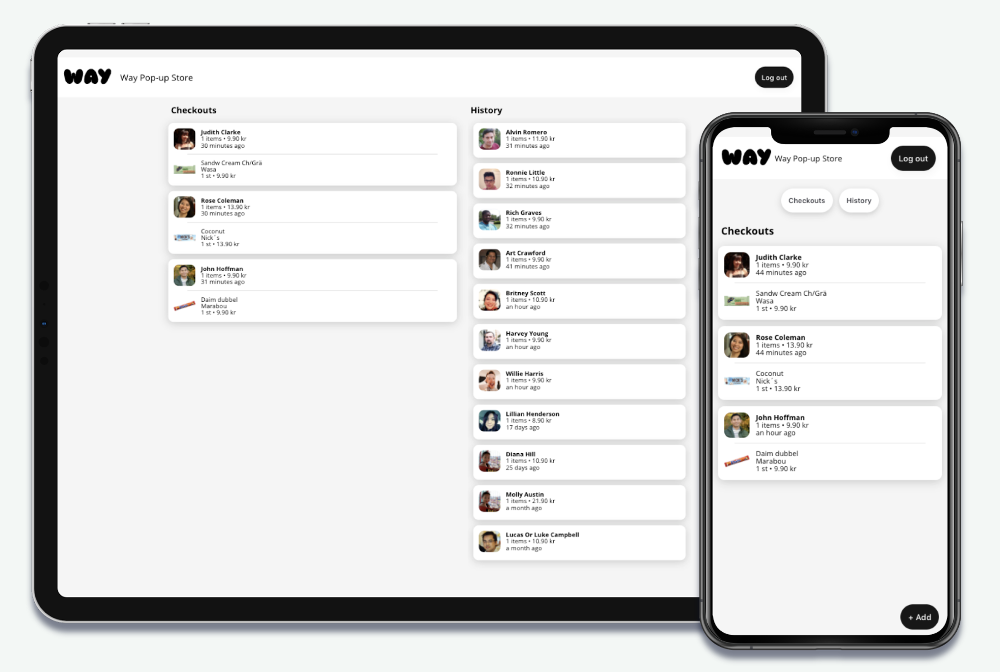

# way-merchant-dashboard

A dashboard for connected merchants to get an overview of their Way order flow.

This was my final graduation project at `</salt>` together with our client [Way](https://www.wayretail.co/) and my team:

- [Oskar Näsman](https://github.com/onasman)
- [Daniel Reed](https://github.com/kwaimind)
- [Isabelle Caspersson](https://github.com/Isabelle-123)

[](https://way-merchant-dashboard.web.app/)



## 👨‍💻 Tech stack

- React (Functional components, Hooks, useReducer)
- Styled Components, React Transitions
- Firebase (Realtime Database, Cloud Functions, Hosting)
- Express
- Jest
- Enzyme

## 🧪 Testing

You can test to see how different users can switch accounts by logging in with the following test accounts

_Way Popup Store_

- test@way.com
- password

## 🔥 Firebase

If this is your first time running the dashboard, you will need to install the Firebase CLI and login: `npm install -g firebase-tools`

You will need to create a `.env` file to connect to the database. This needs to be saved at `client/.env`:

```
REACT_APP_API_KEY=XXXXXX
REACT_APP_AUTH_DOMAIN=XXXXXX
REACT_APP_DB_URL=XXXXXX
REACT_APP_PROJECT_ID=XXXXXX
REACT_APP_STORAGE_BUCKET=XXXXXX
REACT_APP_MESSAGING_ID=XXXXXX
REACT_APP_APPID=XXXXXX
REACT_APP_API_ENDPOINT=XXXXXX
```

Everything can be deployed to Firebase hosting and cloud functions by running `npm run deploy`.

## 🗄️ Using the custom APIs

We've made 2 mock data APIs to simulate users and product images. These are just for demo purposes.

Since this project is hosted on Firebase as a cloud function, the backend is in the `functions` directory.

**_Products_**

Returns a product image from the ICA image database, based on the product GTIN number in the order items data. There are 5 edge cases where ICA does not have the image, in which case we load the image from a Firebase storage bucket.

`GET /api/products/:gtin`

```
{
   "path": "https://assets.icanet.se/t_product_large_v1,f_auto/8717163691618.jpg"
}
```

Any errors return a 404.

**_Customers_**

Returns either array of 100 customers from the [Random User Generator API](https://randomuser.me/).

`GET /api/customers`

```
[
  {
      "id": "43cd510b-de02-42b6-8264-c7eced4d5ff4",
      "name": "Eric Douglas",
      "picture": "https://randomuser.me/api/portraits/men/79.jpg"
  },
  ...
]
```

## 🏗️ Dev guidelines

1. Only use functional components with hooks.
2. Component declarations should use the `function App...` style:
   `export default function App() {...}`
3. Logic functions inside components should use ES6 arrow functions:
   `const logic = () => {...}`